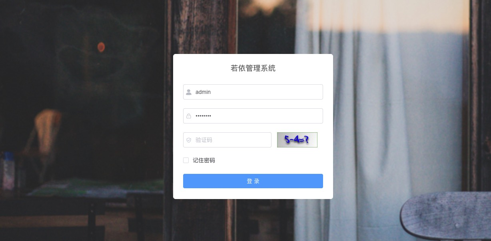
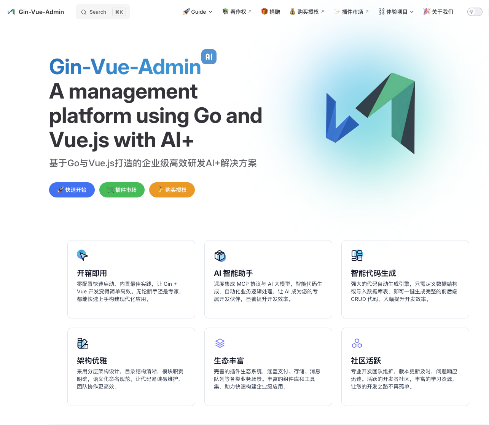

中后台管理系统（Admin/Backend Management System）是企业信息化建设中不可或缺的基础软件，广泛应用于企业、政府、学校等各类组织。它主要用于支撑企业内部的业务流程管理、数据统计分析、权限控制、内容管理等功能，帮助企业实现高效的运营和管理。

随着互联网和云计算的发展，现代中后台管理系统通常采用前后端分离的架构，前端多以 Vue、React 等主流框架开发，后端则常见于 Java、.NET、Node.js、Go 等技术栈。系统具备高度的可扩展性、灵活的权限体系、丰富的组件库和良好的用户体验，能够快速适配不同行业和业务场景的需求。

目前，市面上有许多开源和商业化的中后台管理系统解决方案，极大地降低了企业开发和维护的成本。本文将列举和简要介绍一些主流的中后台管理系统，供大家参考和选型。

## java

### 若依管理系统

若依管理系统采用前后端分离架构（也提供传统的前后端不分离版本），技术栈选择兼顾稳定性与行业主流趋势。

后端技术：基于 Java 语言，以 Spring Boot 为核心框架，整合 Spring Security（权限控制）、MyBatis-Plus（ORM 框架）、Shiro（可选权限方案）等成熟组件，支持 MySQL、Oracle、PostgreSQL 等多种数据库，同时集成 Redis 实现缓存管理、RabbitMQ/Kafka 实现消息队列，满足高并发、高可用场景需求。​

前端技术：主流版本采用 Vue.js 框架，配合 Element UI（或 Element Plus 新版本）组件库构建界面，集成 Vue Router（路由）、Vuex/Pinia（状态管理）、Axios（网络请求）等工具，同时支持 ECharts 数据可视化、WangEditor 富文本编辑等常用功能，兼顾美观性与交互体验。

- <a href="https://ruoyi.vip" alt="官网地址" target="_blank">官网地址</a>
- <a href="http://demo.ruoyi.vip" alt="演示地址" target="_blank">演示地址</a>
- <a href="https://gitee.com/y_project/RuoYi" alt="代码下载" target="_blank">代码下载</a>

## GoLang

### Gin-Vue-Admin

一款基于 Go 语言生态与 Vue.js 技术栈开发的开源企业级中后台管理系统框架，主打 “轻量、高效、易扩展”，专为快速搭建高性能后台管理应用设计。

后端技术：以 Go 语言为开发语言，核心框架选用高性能的 Gin（Go 生态中知名的 Web 框架，以路由响应速度快、内存占用低著称），整合 GORM（Go 语言主流 ORM 框架，简化数据库操作）实现数据交互；权限认证采用 JWT（JSON Web Token）机制，保障接口安全；支持 MySQL、PostgreSQL 等主流数据库，同时集成 Redis 实现缓存管理、日志组件（如 zap）记录系统操作与异常，满足高并发场景下的性能需求，且支持 Docker 容器化部署，简化环境配置。​

前端技术：基于 Vue.js 框架构建，搭配 Element UI（或 Element Plus）组件库快速搭建界面，集成 Vue Router（路由管理）、Vuex/Pinia（状态管理）、Axios（网络请求）等工具；支持 ECharts 数据可视化、Tinymce 富文本编辑、Excel 导入导出等常用功能，同时优化前端性能，如路由懒加载、组件按需引入，兼顾界面美观性与加载速度。

- <a href="https://www.gin-vue-admin.com" alt="官网地址" target="_blank">官网地址 用户名：admin 密码：123456</a>
- <a href="http://demo.gin-vue-admin.com" alt="演示地址" target="_blank">演示地址</a>
- <a href="https://github.com/flipped-aurora/gin-vue-admin" alt="代码下载" target="_blank">代码下载</a>

