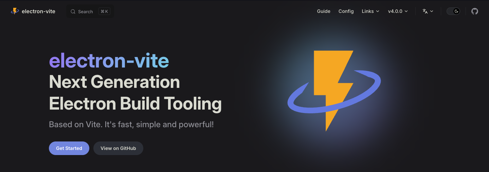

## electron-vie



- <a href="https://electron-vite.org" alt="官网地址" target="_blank">官网地址</a>
- <a href="https://github.com/alex8088/electron-vite" alt="github" target="_blank">github</a>

功能

- Vite 支持: 继承 Vite 的所有优点，使用方式与 Vite 相同。
- 预配置: 针对 Electron 预先配置，不用担心配置问题。
- 优化资源处理: 优化 Electron 主进程的资源处理。
- 热替换 HMR: 渲染器支持模块热替换（HMR）。
- 热重载: 主进程和预加载脚本支持热重载。
- 易于调试: 非常容易在 IDE 中调试，例如 vscode 或 webstorm。
- TypeScript 装饰器: 支持 TS 装饰器和元数据特性。
- 源代码保护: 编译为 V8 字节码以保护源代码。
- 开箱即用: 开箱即用支持 Typescript、Vue、React、Svelte 和 SolidJS 等。

创建项目

```bash
pnpm create @quick-start/electron
```

```bash
yarn create @quick-start/electron
```

```bash
npm create @quick-start/electron@latest
```
